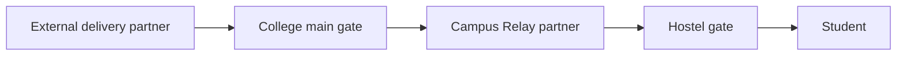
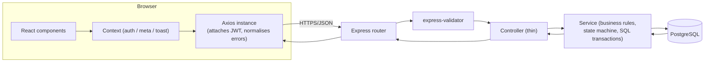
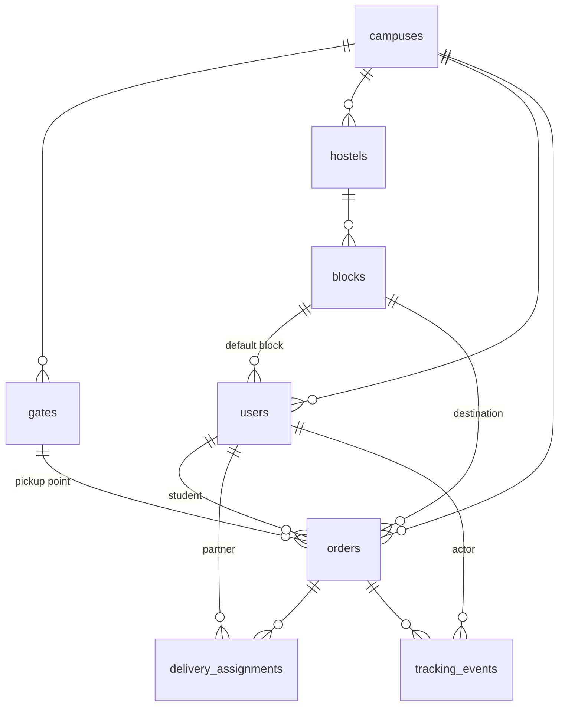

# Campus Relay

A last-mile delivery relay for large college campuses, built with React, Express and
PostgreSQL.

## The problem

On most large campuses, external delivery partners (Swiggy, Zomato, Blinkit, Amazon…)
are not allowed past the main gate into hostel/residential areas for security reasons.
That leaves the last few hundred metres — gate to room — with no one to carry the parcel.

Campus Relay adds a second, campus-only leg: a student raises a request, the external
rider drops the parcel at the main gate, and a Campus Relay delivery partner carries it
the rest of the way to the student's hostel gate.

```
External delivery partner → College main gate → Campus Relay partner → Hostel gate → Student
```



The service is free to use and has **no payment integration** — there is no
`delivery_fee` column anywhere in the schema. That is a deliberate scope decision made
up front, not a missing feature.

## Features by role

| Role | Can do |
|---|---|
| **Student** | Register with phone + password; create a delivery request; confirm the parcel reached the main gate; track its live status; cancel it before a partner picks it up; view their own order history |
| **Delivery partner** | Log in with an account an admin created; see the pool of parcels waiting at gates on their campus; accept one (capped at 3 active deliveries at a time); advance it through pickup → out for delivery → reached hostel gate → delivered; view their own completed deliveries |
| **Admin** | View live counters and a board of everything currently in motion; browse, filter, search and paginate every order; assign or reassign a delivery partner to an order; create delivery partner accounts; activate or deactivate any account; manage campuses, gates, hostels and blocks |

Nobody sees data they shouldn't: a partner previewing the pool sees no phone numbers
until they accept the job, a student who tries another student's order id gets a 404
(never a "you don't have permission" that would confirm the order exists), and every
status change is validated against a fixed state machine on the server — the frontend
only ever renders buttons for transitions the API has already said are legal.

## Tech stack

| Layer | Technology |
|---|---|
| Frontend | React 19 (Vite 8), React Router, Axios, plain CSS — no component library |
| Backend | Node.js, Express 4, CommonJS |
| Database | PostgreSQL 16, raw parameterised SQL via `pg` — no ORM |
| Auth | JWT (`jsonwebtoken`) + `bcryptjs` password hashing |
| Live updates | Polling every 10 seconds — no WebSockets |

These are fixed, deliberate choices , not a partial migration in
progress: no TypeScript, no Redux, no Docker, no chart library.

## Architecture



Every backend route follows the same layering: **route → validator → controller →
service → db**. Controllers stay thin and only translate HTTP in and out; validation
rules live in `server/src/validators`; business rules (the order state machine, the
partner capacity cap, visibility rules for phone numbers) live in `server/src/services`;
nothing talks to PostgreSQL directly except the service layer, and always through
parameterised queries.

On the client, one Axios instance (`client/src/api/client.js`) is the only thing that
ever calls the API. A request interceptor attaches the JWT from `localStorage`; a
response interceptor clears the session and redirects to `/login` on a `401` (except for
the login/register calls themselves) and normalises every error into
`{ status, message, details }` so components never touch `err.response.data`.

## Database schema

8 tables, PostgreSQL 16, no ORM. Config tables (`campuses`, `gates`, `hostels`,
`blocks`) are soft-deactivated rather than deleted, because orders reference them and
old orders must keep displaying correctly after a gate or block is retired.



| Table | Purpose |
|---|---|
| `campuses` | One row per campus |
| `gates` | Pickup points where the external rider stops, scoped to a campus |
| `hostels` | Residential buildings, scoped to a campus, tagged `girls`/`boys` |
| `blocks` | Sub-units of a hostel (e.g. "Block A") — this is what makes Girls Block A and Boys Block A distinct records |
| `users` | Students, partners and admins in one table, distinguished by a `role` column |
| `orders` | One delivery request; carries its own `status` through an 8-state machine |
| `delivery_assignments` | History of which partner carried which order; a partial unique index guarantees only one *active* assignment per order, which is what makes the accept-race safe |
| `tracking_events` | Append-only audit trail — one row per status change, with who did it and when |

## API overview

33 endpoints across auth, orders, admin and campus configuration. Full request/response
shapes, error codes and validation rules are documented in
[`docs/API-CONTRACT.md`](docs/API-CONTRACT.md) — this is only a map.

| Area | Count | Examples |
|---|---|---|
| Public (no token) | 6 | `GET /health`, `GET /meta`, `GET /campuses`, `GET /orders/track/:code` |
| Auth | 5 | `POST /auth/register`, `POST /auth/login`, `GET /auth/me` |
| Orders — any signed-in role | 3 | `GET /orders`, `GET /orders/:id`, `PATCH /orders/:id/status` |
| Orders — student only | 2 | `POST /orders`, `POST /orders/:id/cancel` |
| Orders — partner only | 2 | `GET /orders/available`, `POST /orders/:id/accept` |
| Admin only | 15 | `GET /admin/stats`, `POST /admin/orders/:id/assign`, campus/gate/hostel/block management (including deactivated-record listings for reactivation) |

Every response has a `success` boolean; validation failures return `400` with a
`details` object keyed by field name so the frontend can highlight exactly the fields
that failed.

## Local setup

Needs Node.js 18+ and PostgreSQL 16 running locally. First time on Windows? Follow
[`docs/SETUP-WINDOWS.md`](docs/SETUP-WINDOWS.md) instead — it walks through installing
everything.

```bash
# 1. Database — run once against an empty "campus_relay" database
psql -U postgres -d campus_relay -f db/schema.sql
psql -U postgres -d campus_relay -f db/seed.sql

# 2. Backend
cd server
cp .env.example .env      # then fill in PGPASSWORD and a generated JWT_SECRET
npm install
npm run dev                # http://localhost:5000

# 3. Frontend, in a second terminal
cd client
cp .env.example .env
npm install
npm run dev                # http://localhost:5173
```

Seed data gives you one campus, two gates, 30 blocks and these accounts:

| Role | Phone | Password |
|---|---|---|
| Admin | `9000000001` | `Admin@123` |
| Partner (Ravi Kumar) | `9100000001` | `Partner@123` |
| Partner (Sneha Rani) | `9100000002` | `Partner@123` |
| Student (Arjun Mehta) | `9200000001` | `Student@123` |
| Student (Divya Nair) | `9200000002` | `Student@123` |

## Environment variables

Names and purpose only — actual values live in your own `.env` files, which are
gitignored and never committed.

**`server/.env`**

| Variable | Purpose |
|---|---|
| `PORT` | Port the Express API listens on |
| `NODE_ENV` | `development` locally, `production` when deployed |
| `PGHOST`, `PGPORT`, `PGDATABASE`, `PGUSER`, `PGPASSWORD` | Local PostgreSQL connection details |
| `DATABASE_URL` | Single connection string for hosted PostgreSQL (e.g. Neon); overrides the `PG*` variables above when present |
| `JWT_SECRET` | Secret key used to sign and verify login tokens |
| `JWT_EXPIRES_IN` | How long an issued token stays valid |
| `CORS_ORIGIN` | Comma-separated list of frontend origins the API will accept requests from |

**`client/.env`**

| Variable | Purpose |
|---|---|
| `VITE_API_URL` | Base URL of the backend API the frontend calls |

## Screenshots

Captured at the widths and screens listed in
[`docs/SCREENSHOTS.md`](docs/SCREENSHOTS.md).

| | |
|---|---|
| Landing page |  |
| Student — create request |  |
| Student — order tracking |  |
| Partner — gate pool |  |
| Admin — overview |  |
| Mobile — relay track (375px) |  |

## Future improvements

Honest list — none of this exists yet:

- **Real-time updates instead of polling.** 10-second polling was chosen deliberately for
  cost and simplicity , but WebSockets or SSE would remove the delay
  entirely.
- **Automated frontend tests.** The backend has 40+ assertion-based checks; the client
  has none yet.
- **Push or SMS notifications** when an order's status changes, instead of relying on the
  student having the tracking page open.
- **A calculated ETA** on each pool item and each order-in-progress, instead of just the
  arrival time the student entered when they created the request.
